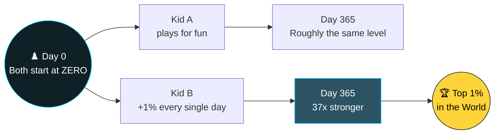

  

---

## 📈 The Numbers Behind the Journey

**+1% today, compounding into 37.8x** — this is what the daily grind actually builds toward.

---

## 👋 About Me

I'm Paresh — building **SushaAstra Technology (SST)**, working across **Robotics, AI, IoT, and Big Data**, based in India.

But more than any single skill, this profile is about one belief:

> **You don't need to start smart. You need to start, and get 1% better than yesterday — every single day.**

Everything you see pinned below — SQL, Python, PySpark, AWS, Kafka, dbt — started at **zero**. No prior background, no shortcuts. Just daily reps.

---

## ♟️ The Chess Parable — Why 1% Matters

Two kids sit down to learn chess on the same day. Both start at **zero**. Neither knows how the pieces move.

- **Kid A** plays casually — a game here and there, no real intent to improve.
- **Kid B** commits to one rule: *get 1% better than yesterday. Every day. No exceptions.*

A year later:

The math backs the story — this is just `1.01^n` compounding, day over day:

| Day | Consistent +1%/day | No improvement |
|---|:---:|:---:|
| Day 1 | 1.00x | 1.00x |
| Day 30 | 1.35x | 1.00x |
| Day 90 | 2.45x | 1.00x |
| Day 180 | 6.00x | 1.00x |
| **Day 365** | **37.8x** | 1.00x |

Neither kid needed talent on day one. The gap wasn't ability — it was **compounding**. That's the entire strategy behind this profile: **start from zero, stay consistent, let the math do the rest.**

---

## 🔭 Zero-to-One Journey in Practice

The clearest proof-of-concept for this philosophy — tracked publicly, day by day:

### 📌 [The Transformation Plan](https://github.com/PARESHRANJAN299/TRANSFORMATION-PLAN-AI_-_Data_Engineering_25_Lakhs)
A structured, day-wise roadmap across SQL, Python, PySpark, AWS, Kafka, dbt, System Design, and DSA — every subject logged, every day of effort tracked, every skill built from absolute zero.

---

## 🔑 Tools I Build With

> *These aren't keys to a paycheck — they're the keys to the world I'm going to build.*
> *I'm not learning these to earn money. One day I'll build my own world with them — starting from zero, no matter how long it takes.*

---

## ⚡ Core Domains — Data Engineering × Robotics

  

---

## 📊 GitHub Stats

---

**Zero to 1% — not by luck, but by daily 1%. 🚀**

