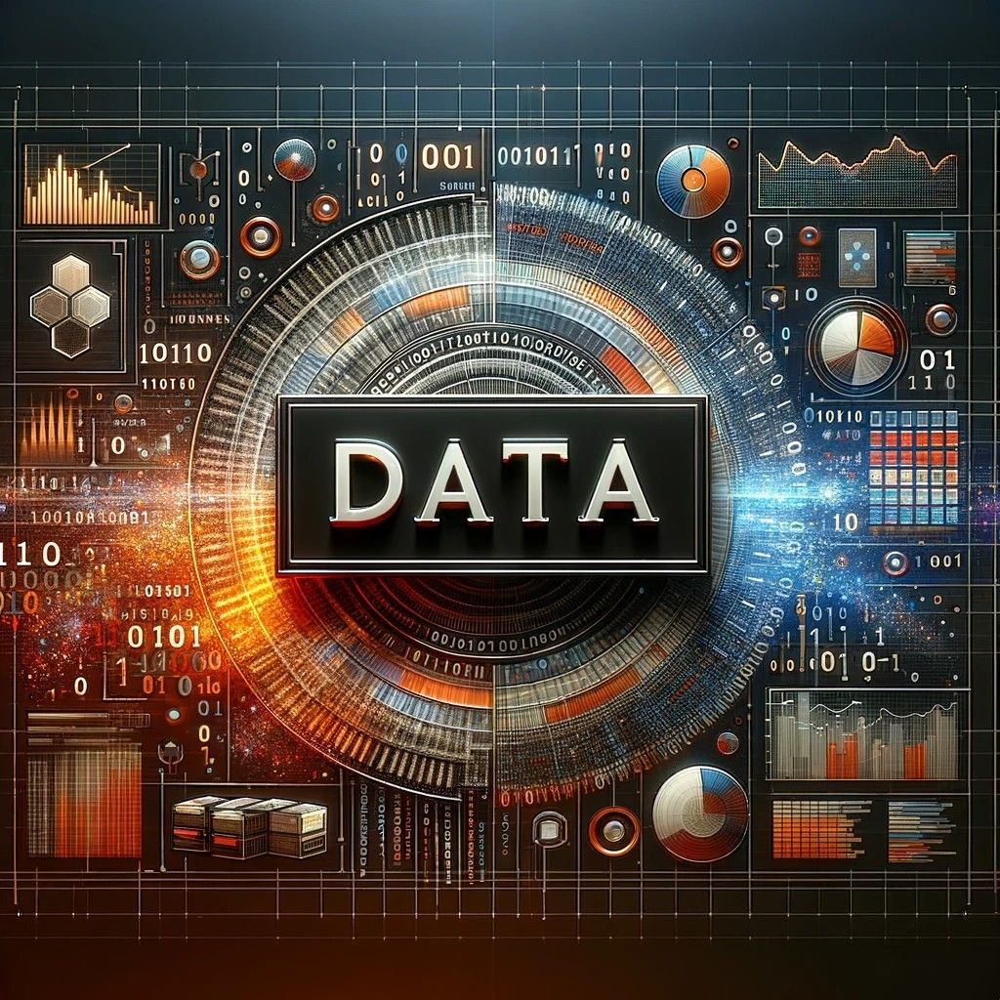

<div align="center">
    
    <br/>
    <br/>
    <a href="https://git.io/typing-svg"></a>
</div>

<div align="center">
    <a href="https://linkedin.com/in/paresh-ranjan-rout-7a2788227"></a>
    <a href="https://youtube.com/@SushaAstraOfficial"></a>
    <br>
    
</div>

## 👋 A little about me...

<table width="100%">
    <tr>
        <td width="30%" align="center" valign="middle">
            
        </td>
        <td width="70%" valign="middle">
            <p>I'm a <strong>Data Engineer in the making</strong> and the founder of <strong>SushaAstra Technology</strong>, working across Data Engineering, Robotics, AI, and IoT. I learn by building real systems end to end, keeping the scope practical, and documenting what I learn, including the issues I hit and how I fixed them.</p>
            <p>My focus is the lakehouse stack: ingesting raw data into cloud storage, then shaping it through Bronze, Silver, and Gold layers on Databricks.</p>
        </td>
    </tr>
</table>

```javascript
const PARESH = {
    role: "Data Engineer (in the making) · Founder, SushaAstra Technology",
    focus: ["Data Engineering", "Robotics", "AI", "IoT"],
    languages: {
        daily: ["Python", "SQL"],
        learning: ["PySpark", "Bash", "C++"]
    },
    dataEngineering: {
        lakehouse: ["Databricks", "Delta Lake", "Unity Catalog", "Auto Loader", "Lakeflow Pipelines"],
        architecture: ["Bronze / Silver / Gold (medallion)", "Incremental ingestion", "Streaming events"],
        databases: ["PostgreSQL", "MySQL"],
        deployment: ["Databricks Asset Bundles"]
    },
    cloud: {
        aws: ["EC2", "S3", "IAM roles (no access keys)"],
        also: ["Azure", "Docker", "Linux"]
    },
    devOps: ["Git", "GitHub", "uv", "GitHub Actions (planned)"],
    robotics: ["ROS", "Arduino", "Raspberry Pi", "OpenCV"],
};
```

---

## 🛠️ Tools I build with

### Data Engineering

       

### Cloud / Infrastructure


### Development / DevOps

 

### Robotics / AI

    

---

<details open>
<summary><a name="certificates"></a><h2>🎓 Certificates</h2></summary>

<!--
  HOW TO ADD A CERTIFICATE
  1. Drop the image into assets/certificates/  (e.g. assets/certificates/databricks-fundamentals.png)
  2. Copy one <td> block below, fix the image path, title, issuer and link.
  3. Keep two certificates per <tr> so the grid stays tidy on mobile.
-->

<div align="center">
<table>
<tr>
<td align="center" width="50%">
    <!-- <a href="CREDENTIAL_URL"></a><br/> -->
    <sub><b>Certificate 1</b> · Issuer · Year</sub><br/>
    <sub><i>Coming soon</i></sub>
</td>
<td align="center" width="50%">
    <!-- <a href="CREDENTIAL_URL"></a><br/> -->
    <sub><b>Certificate 2</b> · Issuer · Year</sub><br/>
    <sub><i>Coming soon</i></sub>
</td>
</tr>
</table>
</div>

</details>

---

## ♟️ The 1% Principle

I use chess as a reminder that steady practice compounds. The model is simple: `1.01^365 ≈ 37.8`. It is a metaphor for consistency, not a promise of results.

| Day | Daily improvement model |
| --- | ---: |
| 30 | 1.35x |
| 90 | 2.45x |
| 180 | 6.00x |
| 365 | 37.8x |

My [Transformation Plan](https://github.com/PARESHRANJAN299/TRANSFORMATION-PLAN-AI_-_Data_Engineering_25_Lakhs) tracks the work across SQL, Python, PySpark, AWS, Kafka, dbt, System Design, and DSA.

<div align="center">
    
</div>

---

<details open>
<summary><h2>📊 GitHub Activity</h2></summary>

<div align="center">
    
    
    <br/>
    
    
</div>

</details>

---

<div align="center">
    

    <p><strong>Start from zero. Improve 1% every day. Build patiently and consistently.</strong></p>
</div>
