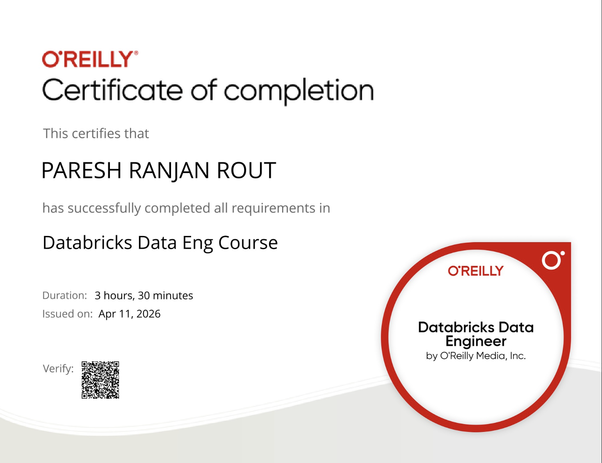
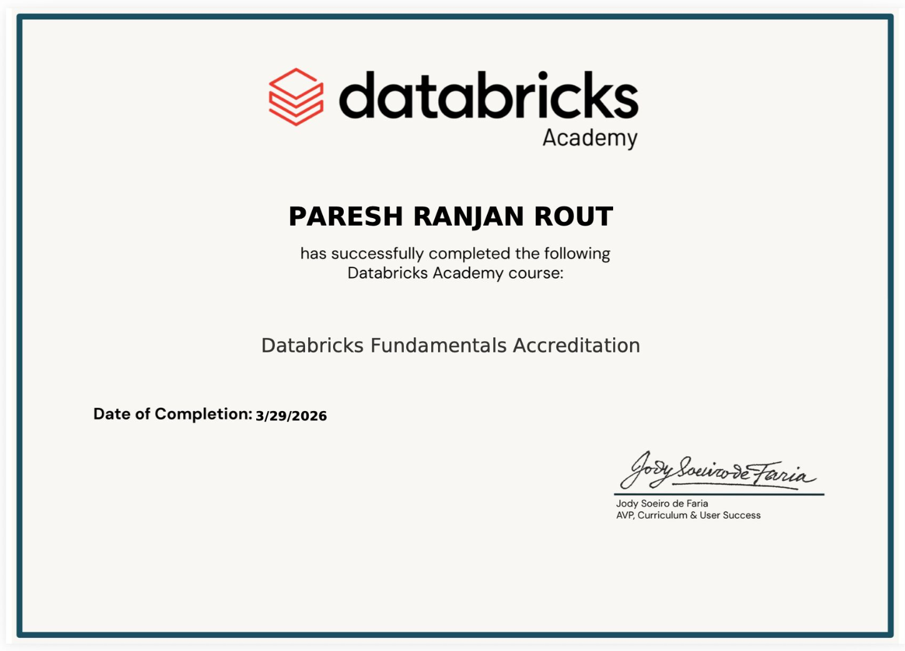

<div align="center">
    
    <br/>
    <br/>
    <a href="https://git.io/typing-svg"></a>
</div>

<div align="center">
    <a href="https://linkedin.com/in/paresh-ranjan-rout-7a2788227"></a>
    <a href="https://youtube.com/@SushaAstraOfficial"></a>
    <br>
    
</div>

## 👋 A little about me...

<table width="100%">
    <tr>
        <td width="30%" align="center" valign="middle">
            
        </td>
        <td width="70%" valign="middle">
            <p>I'm a <strong>Data Engineer in the making</strong> and the founder of <strong>SushaAstra Technology</strong>, working across Data Engineering, Robotics, AI, and IoT. I learn by building real systems end to end, keeping the scope practical, and documenting what I learn, including the issues I hit and how I fixed them.</p>
            <p>My focus is the lakehouse stack: ingesting raw data into cloud storage, then shaping it through Bronze, Silver, and Gold layers on Databricks.</p>
        </td>
    </tr>
</table>

```javascript
const PARESH = {
    role: "Data Engineer (in the making) · Founder, SushaAstra Technology",
    focus: ["Data Engineering", "Robotics", "AI", "IoT"],
    languages: {
        daily: ["Python", "SQL"],
        learning: ["PySpark", "Bash", "C++"]
    },
    dataEngineering: {
        lakehouse: ["Databricks", "Delta Lake", "Unity Catalog", "Auto Loader", "Lakeflow Pipelines"],
        architecture: ["Bronze / Silver / Gold (medallion)", "Incremental ingestion", "Streaming events"],
        databases: ["PostgreSQL", "MySQL"],
        deployment: ["Databricks Asset Bundles"]
    },
    cloud: {
        aws: ["EC2", "S3", "IAM roles (no access keys)"],
        also: ["Azure", "Docker", "Linux"]
    },
    devOps: ["Git", "GitHub", "uv", "GitHub Actions (planned)"],
    robotics: ["ROS", "Arduino", "Raspberry Pi", "OpenCV"],
};
```

---

## 🛠️ Tools I build with

<div align="center">
<table>
<tr>
<td align="center" width="110"><br/><sub><b>Python</b></sub></td>
<td align="center" width="110"><br/><sub><b>PostgreSQL</b></sub></td>
<td align="center" width="110"><br/><sub><b>MySQL</b></sub></td>
<td align="center" width="110"><br/><sub><b>Spark</b></sub></td>
<td align="center" width="110"><br/><sub><b>Databricks</b></sub></td>
<td align="center" width="110"><br/><sub><b>Kafka</b></sub></td>
<td align="center" width="110"><br/><sub><b>dbt</b></sub></td>
</tr>
</table>
<table>
<tr>
<td align="center" width="110"><br/><sub><b>AWS</b></sub></td>
<td align="center" width="110"><br/><sub><b>Azure</b></sub></td>
</tr>
</table>
</div>

---

<details open>
<summary><a name="certificates"></a><h2>🎓 Certificates</h2></summary>

<div align="center">
<table>
<tr>
<td align="center" width="50%" valign="top">
    <a href="./assets/certificates/oreilly-databricks-data-engineer.png"></a><br/>
    <b>Databricks Data Eng Course</b><br/>
    <sub>O'Reilly · Issued Apr 11, 2026</sub><br/>
    <sub>Credential ID <code>270a6904-bfae-45c1-aa45-e2c4e7bdca26</code></sub>
</td>
<td align="center" width="50%" valign="top">
    <a href="./assets/certificates/databricks-fundamentals-accreditation.png"></a><br/>
    <b>Databricks Fundamentals Accreditation</b><br/>
    <sub>Databricks Academy · Completed Mar 29, 2026</sub>
</td>
</tr>
</table>

<br/>

<table>
<tr>
<td align="center" width="33%" valign="top">
    <b>Azure Data Factory Training for DP-203</b><br/>
    <sub>Intellipaat · Issued Dec 15, 2024</sub><br/>
    <sub>Certificate ID <code>31679-189383-205482</code></sub>
</td>
<td align="center" width="33%" valign="top">
    <b>Oracle Database 12c Administrator Certified Associate: RDBMS Concepts Literacy (Beginner)</b><br/>
    <sub>Grow@Lenovo · Completed Jan 6, 2024</sub>
</td>
<td align="center" width="33%" valign="top">
    <b>Diploma in Network Administration</b><br/>
    <sub>Jetking (NSDC Skill Development Partner) · Jul 2019 – Oct 2021 · 572 hrs · Grade B</sub><br/>
    <sub>Serial No. <code>1920-006104</code></sub>
</td>
</tr>
</table>
</div>

</details>

---

## ♟️ The 1% Principle

I use chess as a reminder that steady practice compounds. The model is simple: `1.01^365 ≈ 37.8`. It is a metaphor for consistency, not a promise of results.

| Day | Daily improvement model |
| --- | ---: |
| 30 | 1.35x |
| 90 | 2.45x |
| 180 | 6.00x |
| 365 | 37.8x |

My [Transformation Plan](https://github.com/PARESHRANJAN299/TRANSFORMATION-PLAN-AI_-_Data_Engineering_25_Lakhs) tracks the work across SQL, Python, PySpark, AWS, Kafka, dbt, System Design, and DSA.

<div align="center">
    
</div>

---

<details open>
<summary><h2>📊 GitHub Activity</h2></summary>

<div align="center">
    
    
    <br/>
    
    
</div>

</details>

