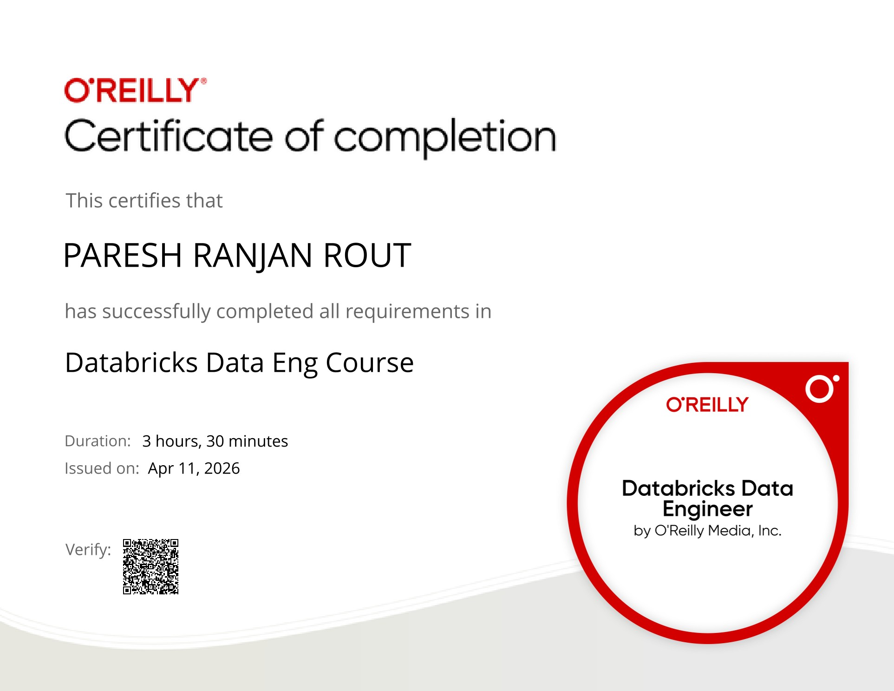
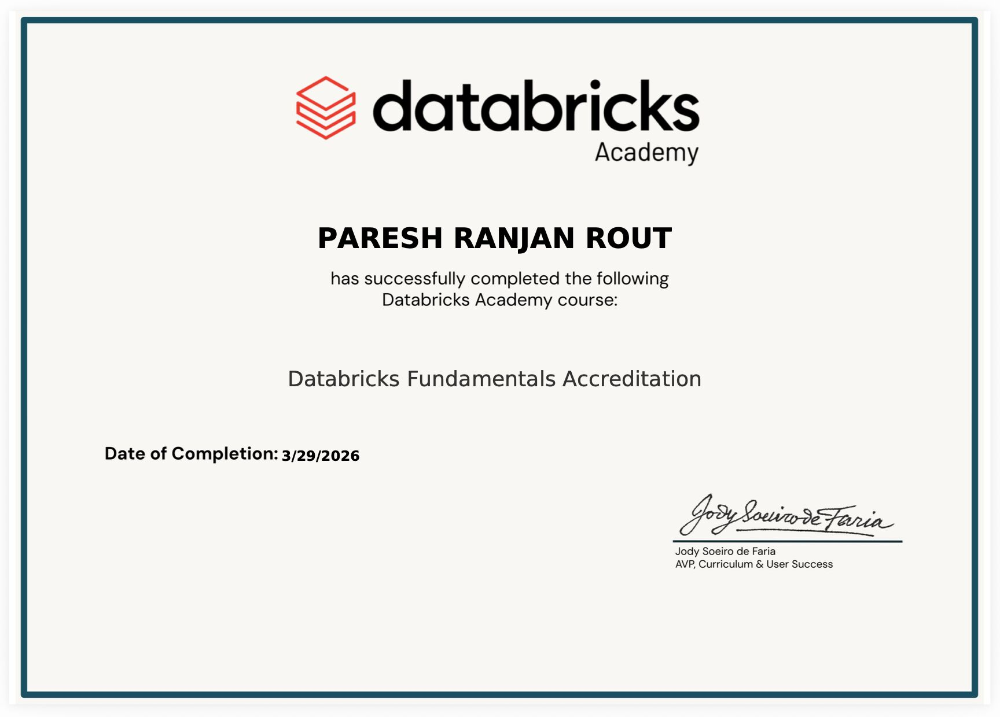
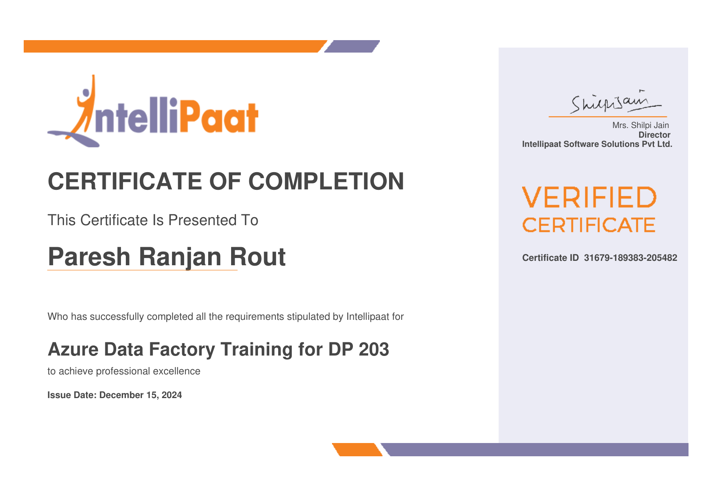
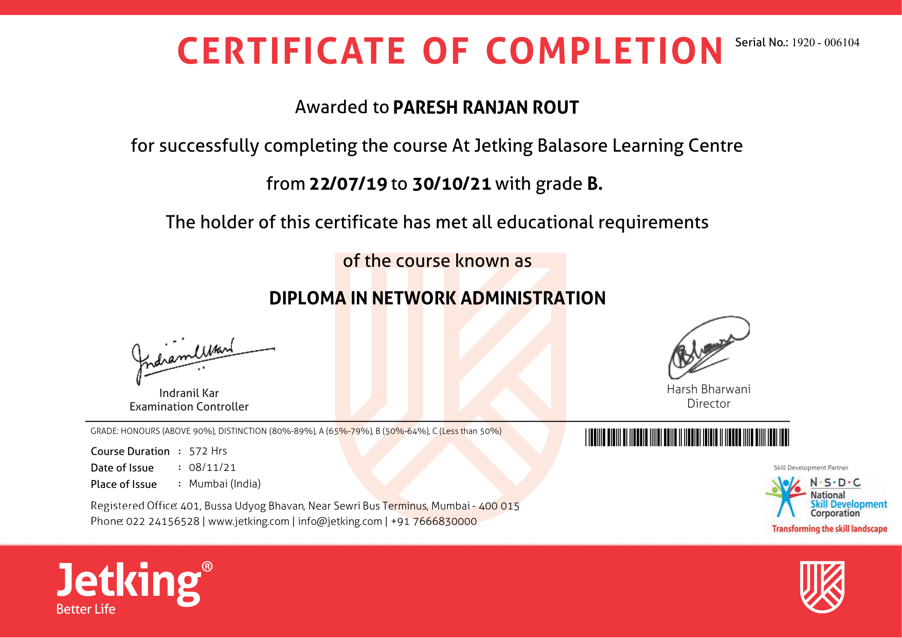

<div align="center">
    
    <br/>
    <br/>
    <a href="https://git.io/typing-svg"></a>
</div>

<div align="center">
    <a href="https://linkedin.com/in/paresh-ranjan-rout-7a2788227"></a>
    <a href="https://youtube.com/@SushaAstraOfficial"></a>
    <br>
    
</div>

## About

<table width="100%">
    <tr>
        <td width="28%" align="center" valign="middle">
            
        </td>
        <td width="72%" valign="middle">
            <h3>Paresh Ranjan Rout</h3>
            <p><strong>Data Engineer</strong> · Founder, SushaAstra Technology</p>
            <p>I design and build cloud data pipelines on Databricks and AWS, taking data from raw ingestion through governed Bronze, Silver, and Gold layers. My work emphasizes reliable incremental ingestion, secure access control, and clear technical documentation.</p>
            <p><strong>Core areas:</strong> Databricks lakehouse, Delta Lake, Unity Catalog, Python, SQL, AWS, and Azure.</p>
        </td>
    </tr>
</table>

```javascript
const PARESH = {
    role: "Data Engineer · Founder, SushaAstra Technology",
    focus: ["Data Engineering", "AI", "IoT"],
    languages: ["Python", "SQL", "PySpark", "Bash"],
    dataEngineering: {
        lakehouse: ["Databricks", "Delta Lake", "Unity Catalog", "Auto Loader", "Lakeflow Pipelines"],
        architecture: ["Bronze / Silver / Gold (medallion)", "Incremental ingestion", "Streaming events"],
        databases: ["PostgreSQL", "MySQL"],
        deployment: ["Databricks Asset Bundles"]
    },
    cloud: {
        aws: ["EC2", "S3", "IAM"],
        azure: ["Azure Data Factory"],
        also: ["Docker", "Linux"]
    },
    tooling: ["Git", "GitHub", "uv"],
};
```

---

## Projects

Each project expands to show its architecture, what I built and the technology behind it.

<!-- To add a project: add a row at the bottom of this table, then copy the project 1 <details> block below. -->

| # | Project | What it does | Technology |
| :-: | --- | --- | --- |
| 1 | [data-engineering-devops-stack](#project-1) | Streams live market data into a Databricks lakehouse, with scheduling, monitoring and deployment as code | Python · AWS EC2, S3, IAM · Databricks · Delta Lake · Unity Catalog · Auto Loader · PySpark |

<details open>
<summary><a name="project-1"></a><h3>1 · data-engineering-devops-stack: real-time pipeline on Databricks and AWS</h3></summary>

<div align="center">
    <a href="https://github.com/PARESHRANJAN299/data-engineering-devops-stack"></a>
</div>

A production-style streaming pipeline that ingests live BTC-USD ticker events from Coinbase into a Databricks lakehouse. Data lands in S3, is loaded incrementally into Bronze and Silver Delta tables every 15 minutes, and is deployed as code with a Databricks Asset Bundle. Every phase is documented with the commands, the issues faced, the root cause and the fix.

| Layer | What I built |
| --- | --- |
| **Ingestion** | Python WebSocket consumer on AWS EC2, run as a `systemd` service. It buffers events, writes one JSON batch per flush to S3 with `boto3` using an IAM role (no stored access keys), reconnects with backoff, retries uploads and spools to disk if S3 is unavailable. |
| **Governed access** | Unity Catalog Storage Credential and External Location give Databricks controlled access to the raw S3 data. |
| **Bronze** | Auto Loader (`cloudFiles`) in a serverless Lakeflow pipeline appends raw events to a Delta table, adding the source file and ingestion timestamp. |
| **Silver** | Parses the nested JSON, flattens it to one row per price update, casts to `DECIMAL` and `TIMESTAMP`, enforces four data-quality expectations and removes duplicates. |
| **Operations** | A Databricks job runs the pipeline every 15 minutes with retries and failure email. A separate health-check job alerts if the consumer stops writing to S3. |
| **Delivery** | The pipeline, jobs and schedules are defined in a Databricks Asset Bundle (`dev` target) and deployed from the command line. |

<details open>
<summary><h4>Connections, live flow and rules</h4></summary>

<div align="center">
    
</div>

Every hop in the architecture is a deliberate connection with its own protocol, its own access rule and its own cadence. The numbered badges on the diagram above match the rows here.

- **Least privilege, split by direction.** The EC2 instance can write only under the raw prefix through an IAM role with temporary credentials, and Databricks reads that prefix through a separate read-only role. Neither side holds the other's permissions, and no access keys are stored in code.
- **Governed, not open.** Databricks reaches S3 only through a Unity Catalog Storage Credential and External Location, so access is controlled and auditable in one place.
- **Failure rules at every step.** Reconnect and ping on the socket, retries and a disk spool on upload, a checkpoint and quality rules in the pipeline, and retries plus email alerts on the jobs.

</details>

<details open>
<summary><h4>How the streaming buffer works</h4></summary>

<div align="center">
    
</div>

1. **Receive.** The WebSocket client gets a JSON message for every BTC-USD ticker update and keeps the ticker events.
2. **Buffer.** Events collect in a Python list in memory. The list is capped at 50,000 events, and the oldest are dropped if it ever fills.
3. **Flush.** When a message arrives and at least 15 seconds have passed since the last flush, the buffer is written out as **one JSON-lines file** and emptied. The check runs on each message, so there is no separate timer thread.
4. **Upload.** `boto3` puts the file in S3 under `coinbase/raw/YYYY/MM/DD/HH/`, using the EC2 IAM role, with up to 5 attempts and a growing wait between them.
5. **If S3 is unreachable,** the file is saved to a local spool folder so the buffer cannot grow forever. Spooled files are uploaded after the next successful flush and again at startup.
6. **Stay alive.** A dropped connection triggers a reconnect with backoff from 1 to 60 seconds, a ping every 20 seconds detects silent failures, and a stop signal triggers a final flush. systemd restarts the service if it exits.
7. **Hand off.** Each new file is picked up by Auto Loader into Bronze on the next 15-minute job run.

</details>

<details open>
<summary><h4>Scale-up path: from startup scale to large scale</h4></summary>

<div align="center">
    
</div>

This build is designed for **startup scale**: a single stream and modest volume, with the lowest cost and the least to operate. It is not meant for large scale. One consumer is a single point of failure, one connection caps throughput, the in-memory buffer is lost if the process is killed without a stop signal, and scaling means managing servers.

| Stage | Architecture | Use it when |
| --- | --- | --- |
| **1. Today** | Source → one EC2 consumer → S3 → Auto Loader → Bronze and Silver | One stream, modest volume, small team |
| **2. Harden** | Same flow, with the consumer in a container on ECS Fargate (image stored in ECR), automatic restarts and CloudWatch alarms | Still one stream, but you want automated deploys and no server to look after |
| **3. Large scale** | Producers → **Kinesis Data Streams** → **Amazon Data Firehose** → S3 → Auto Loader → Bronze, Silver, Gold | High volume, many sources, replay and availability requirements |

**Why Kinesis and Firehose at scale.** Kinesis Data Streams scales with shards, keeps data for replay and lets several consumers read the same stream. Firehose then takes over what the Python consumer does by hand: buffering by size or time, retrying, optional transformation, and writing partitioned files to S3. The Databricks side stays almost the same, which is why the Bronze and Silver design here carries over. For seconds-level latency, Databricks can read from Kinesis directly instead of waiting for files.

**What I would keep.** Raw Bronze, Silver deduplication on a key (streams deliver at least once), data-quality expectations, Asset Bundle deployment and the freshness alert.

**When to move up.** Move off the single consumer when it can no longer keep up, when more sources or consumers appear, or when you need guaranteed replay or higher availability. For one ticker, Kinesis would add cost and moving parts without a benefit. Check current AWS limits and pricing before sizing.

</details>

<table>
<tr>
<td><b>Built with</b></td>
<td align="center" width="84"><br/><sub>Python</sub></td><td align="center" width="84"><br/><sub>AWS</sub></td><td align="center" width="84"><br/><sub>Databricks</sub></td><td align="center" width="84"><br/><sub>PySpark</sub></td><td align="center" width="84"><br/><sub>SQL</sub></td>
</tr>
</table>

Python, AWS (EC2, S3, IAM), `systemd`, Databricks Asset Bundles, Unity Catalog, Auto Loader, Lakeflow pipelines, Delta Lake, PySpark and SQL.

**Status:** ingestion, Bronze, Silver, scheduling and monitoring are complete. Gold transformations, a data-quality framework and GitHub Actions CI/CD are next.

<div align="center">
    <a href="https://github.com/PARESHRANJAN299/data-engineering-devops-stack"></a>
    <a href="https://github.com/PARESHRANJAN299/data-engineering-devops-stack/blob/main/05-databricks-asset-bundle.md"></a>
</div>

</details>

<!--
  TO ADD ANOTHER PROJECT
  1. Add a row to the table above.
  2. Copy the whole <details> block for project 1, then change the number, name, diagram, description and technology.
  3. Put its images in assets/ and keep <details> without "open" so only project 1 starts expanded.
-->

---

## Core Technologies

<div align="center">

<p><sub><b>LANGUAGES &amp; PROCESSING</b></sub></p>
<table>
<tr>
<td align="center" width="110"><br/><sub><b>Python</b></sub></td>
<td align="center" width="110"><br/><sub><b>SQL</b></sub></td>
<td align="center" width="110"><br/><sub><b>PySpark</b></sub></td>
<td align="center" width="110"><br/><sub><b>Databricks</b></sub></td>
<td align="center" width="110"><br/><sub><b>Kafka</b></sub></td>
<td align="center" width="110"><br/><sub><b>dbt</b></sub></td>
</tr>
</table>

<p><sub><b>DATABASES &amp; CLOUD</b></sub></p>
<table>
<tr>
<td align="center" width="110"><br/><sub><b>PostgreSQL</b></sub></td>
<td align="center" width="110"><br/><sub><b>MySQL</b></sub></td>
<td align="center" width="110"><br/><sub><b>AWS</b></sub></td>
<td align="center" width="110"><br/><sub><b>Azure</b></sub></td>
</tr>
</table>

<p><sub><b>DATA ENGINEERING PRACTICE</b></sub></p>
<table>
<tr>
<td align="center" width="110"><br/><sub><b>Data Cleaning</b></sub></td>
<td align="center" width="110"><br/><sub><b>ETL Pipelines</b></sub></td>
<td align="center" width="110"><br/><sub><b>System Design</b></sub></td>
</tr>
</table>

<sub>System design for large-scale, high-volume data pipelines.</sub>

</div>

---

<details open>
<summary><a name="certificates"></a><h2>Certifications</h2></summary>

<div align="center">
<table>
<tr>
<td align="center" width="50%" valign="top">
    <a href="./assets/certificates/oreilly-databricks-data-engineer.jpeg"></a><br/>
    <b>Databricks Data Eng Course</b><br/>
    <sub>O'Reilly · Issued Apr 11, 2026</sub><br/>
    <sub>Credential ID <code>270a6904-bfae-45c1-aa45-e2c4e7bdca26</code></sub>
</td>
<td align="center" width="50%" valign="top">
    <a href="./assets/certificates/databricks-fundamentals-accreditation.jpeg"></a><br/>
    <b>Databricks Fundamentals Accreditation</b><br/>
    <sub>Databricks Academy · Completed Mar 29, 2026</sub>
</td>
</tr>
</table>

<br/>

<table>
<tr>
<td align="center" width="33%" valign="top">
    <a href="./assets/certificates/azure-data-factory-dp203.pdf"></a><br/>
    <b>Azure Data Factory Training for DP-203</b><br/>
    <sub>Intellipaat · Issued Dec 15, 2024</sub><br/>
    <sub>Certificate ID <code>31679-189383-205482</code></sub>
</td>
<td align="center" width="33%" valign="top">
    <a href="./assets/certificates/oracle-rdbms-concepts-literacy.pdf"></a><br/>
    <b>Oracle Database 12c Administrator Certified Associate: RDBMS Concepts Literacy (Beginner)</b><br/>
    <sub>Grow@Lenovo · Completed Jan 6, 2024</sub>
</td>
<td align="center" width="33%" valign="top">
    <a href="./assets/certificates/jetking-network-administration-diploma.pdf"></a><br/>
    <b>Diploma in Network Administration</b><br/>
    <sub>Jetking (NSDC Skill Development Partner) · Jul 2019 – Oct 2021 · 572 hrs · Grade B</sub><br/>
    <sub>Serial No. <code>1920-006104</code></sub>
</td>
</tr>
</table>
</div>

</details>

---

## Approach: Consistency Compounds

Small, consistent daily improvements compound. The chart below refreshes itself every few hours through GitHub Actions. It shows my position on the 1% curve (`1.01^365 ≈ 37.8`) next to my live GitHub contribution streaks. The curve illustrates the value of consistency, not a guaranteed outcome.

<div align="center">
    
</div>

<div align="center">
    
</div>

---

## Activity at a Glance

<div align="center">
    
</div>

